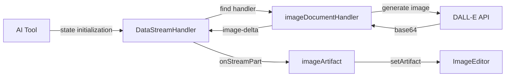

# Image Artifact Lifecycle Tutorial

## 1. Core Components

### Data Flow


### Key Files Structure
```
├── lib/ai/tools/
│   └── detect-image-request.ts    # AI tool that manages artifact state and image generation
├── lib/artifacts/
│   └── server.ts                  # Registers document handlers
├── artifacts/image/
│   ├── client.tsx                 # Image artifact definition & UI handling
│   └── server.ts                  # Image generation & document handling
└── components/
    └── data-stream-handler.tsx    # Manages data stream and artifact state
```

## 2. Lifecycle Steps

### Step 1: AI Tool Manages State and Initiates Generation
```typescript
// lib/ai/tools/detect-image-request.ts
export function detectImageRequest({ session, dataStream }: Props): Tool {
  return {
    description: 'Detects if user message requests image generation',
    parameters: DetectImageRequestSchema,
    execute: async (args) => {
      const { shouldGenerateImage, imagePrompt } = args;
      
      // Early return if not generating
      if (!shouldGenerateImage || !imagePrompt) {
        return null;
      }

      // Reset artifact state first
      dataStream.writeData({
        type: 'clear',
        content: '',
      });

      try {
        const id = generateUUID();
        
        // Initialize document and make artifact visible immediately
        dataStream.writeData({
          type: 'kind',
          content: 'image',
        });

        dataStream.writeData({
          type: 'id',
          content: id,
        });

        dataStream.writeData({
          type: 'title',
          content: imagePrompt,
        });

        // Set status to streaming and make visible
        dataStream.writeData({
          type: 'status',
          content: 'streaming',
        });

        dataStream.writeData({
          type: 'visibility',
          content: true,
        });

        // Generate image via document handler
        await documentHandler.onCreateDocument({
          id,
          title: imagePrompt,
          dataStream,
          session,
        });

        dataStream.writeData({ type: 'finish', content: '' });
        
        // Return null as the AI model handles user communication
        return 'Image generated: ${imagePrompt}`;
      } catch (error) {
        // Clean up UI state on error
        dataStream.writeData({ type: 'clear', content: '' });
        dataStream.writeData({ type: 'status', content: 'idle' });
        dataStream.writeData({ type: 'visibility', content: false });
        
        // Let the error propagate to be handled by the AI model
        throw error;
      }
    }
  };
}
```

### Step 2: Server Handler Generates Image
```typescript
// artifacts/image/server.ts
export const imageDocumentHandler = createDocumentHandler<'image'>({
  kind: 'image',
  onCreateDocument: async ({ title, dataStream }) => {
    try {
      const { image } = await experimental_generateImage({
        model: myProvider.imageModel('dalle'),
        prompt: title,
        n: 1,
        size: "1024x1024",
      });

      if (!image || !image.base64) {
        throw new Error('No image data received from DALL-E');
      }

      dataStream.writeData({
        type: 'image-delta',
        content: image.base64,
      });

      return image.base64;
    } catch (error) {
      // Handle specific error types
      if (error instanceof Error) {
        if (error.message.includes('rate limit')) {
          throw new Error('Rate limit exceeded. Please wait a moment before trying again.');
        }
        if (error.message.includes('content policy')) {
          throw new Error('The image request was rejected due to content policy. Please try a different prompt.');
        }
        throw new Error(error.message);
      }
      throw new Error('Failed to generate image. Please try again.');
    }
  }
});
```

### Step 3: Client Handles Image Stream
```typescript
// artifacts/image/client.tsx
export const imageArtifact = new Artifact({
  kind: 'image',
  onStreamPart: ({ streamPart, setArtifact }) => {
    if (streamPart.type === 'image-delta') {
      setArtifact((draftArtifact) => ({
        ...draftArtifact,
        content: streamPart.content as string,
        isVisible: true,
        status: 'streaming',
      }));
    }
  },
  content: ImageEditor
});
```

## 3. Critical Requirements

### Tool Registration in Chat Route
```typescript
// app/(chat)/api/chat/route.ts
export async function POST(request: Request) {
  return createDataStreamResponse({
    execute: (dataStream) => {
      const result = streamText({
        // Both entries are required
        experimental_activeTools: [
          'detectImageRequest',
          // ... other tools
        ],
        tools: {
          detectImageRequest: detectImageRequest({
            session,
            dataStream,
          }),
          // ... other tools
        }
      });
    }
  });
}
```

### Data Stream Handler Types
```typescript
// components/data-stream-handler.tsx
export type DataStreamDelta = {
  type:
    | 'text-delta'
    | 'code-delta'
    | 'sheet-delta'
    | 'image-delta'
    | 'title'
    | 'id'
    | 'suggestion'
    | 'clear'
    | 'finish'
    | 'kind'
    | 'visibility'
    | 'status';
  content: string | Suggestion | boolean;
};
```

## 4. Key Implementation Points

1. **State Management**
   - AI Tool manages complete artifact lifecycle
   - Must reset state before starting
   | 'id'
    | 'suggestion'
    | 'clear'
    | 'finish'
    | 'kind'
    | 'visibility'
    | 'status';
  content: string | Suggestion | boolean;
};
```

## 5. Common Issues & Solutions

1. **Tool Invocation Errors**
   - Check tool registration in chat route
   - Verify system prompt matches capabilities
   - Check error propagation to AI model

2. **UI State Issues**
   - Verify state reset before generation
   - Check all stream types are handled
   - Ensure proper cleanup on errors

3. **Image Generation Failures**
   - Check DALL-E API configuration
   - Verify error handling in server handler
   - Monitor server logs for specific errors

## 6. Best Practices

1. Always reset state before starting
2. Always clean up state on errors
3. Let the AI model handle user communication
4. Handle specific error cases with clear messages
5. Maintain proper tool registration
6. Follow type-safe stream messaging
7. Log errors with context for debugging

This documentation reflects the production implementation where the AI tool focuses on technical implementation while letting the AI model handle user communication.
